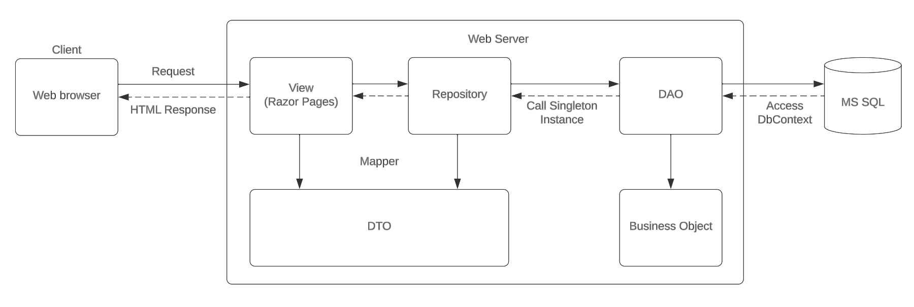
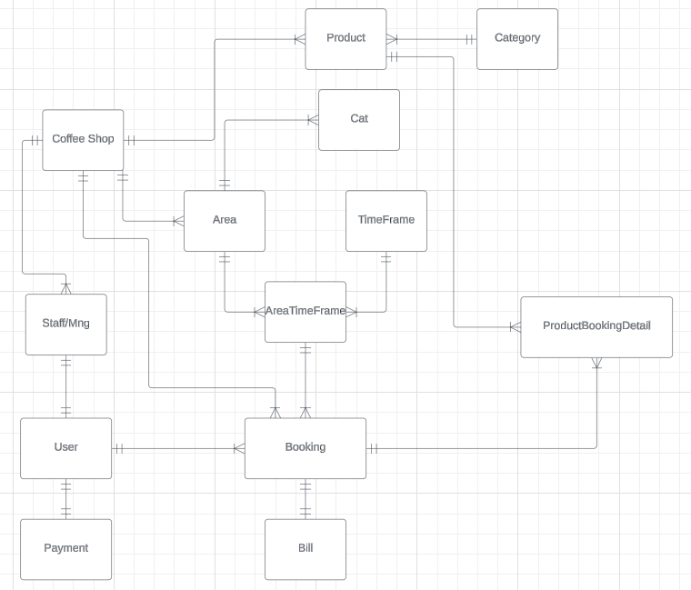
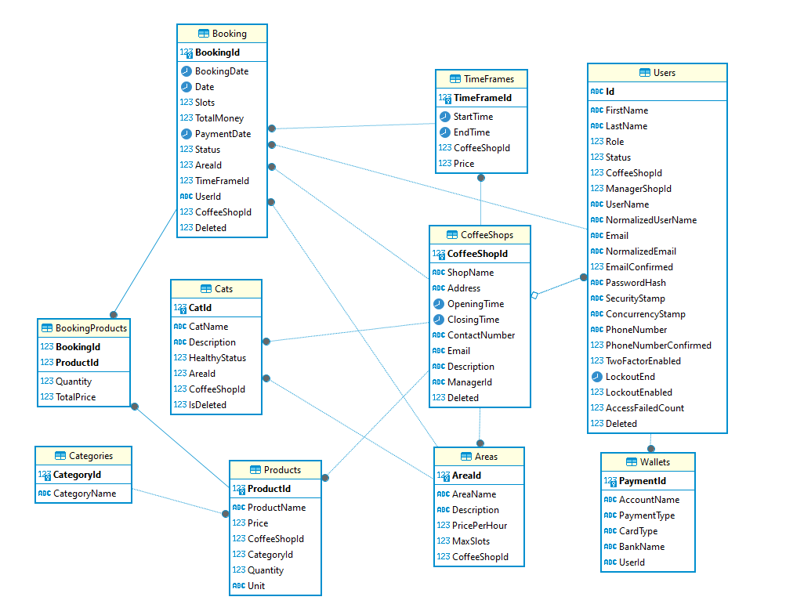

# Cat Coffee Platform

  

  
  
  
  

## Introduction

The Cat Coffee Platform is a platform connecting cat coffee shops. It is design to make ease for customer to make a booking at their favorite cat coffee shop as well as ease for shop manager to manage their income. The project is for the course Building Cross-platform Backend Application with .NET at FU.

## System Design

These are the technologies that will be used in the making of this project:

- Database: MS SQL
- ORM: Microsoft Entity Framework Core
- Framework: Microsoft .NET
- Backend API: ASP.NET Core API with OData, JWT Authenticated
- View: Razor Pages

The system utilize the power of .NET tech stack, Razor Pages client and ASP.NET Web API. API implement using Repository pattern along with Singleton pattern, AutoMapper will also be use for DTO. OData and JWT authenticated are also support.

  
  
Architecture Design

 

  
  
Conceptual Database Design

 

  
  
Implemented Database

## Contributors

